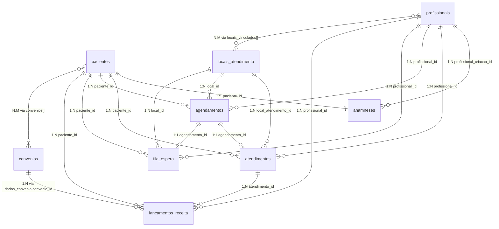

# Esquema do Banco de Dados — MedFlow

> Sistema de Gerenciamento de Consultório Médico  
> Banco: **MongoDB** via **Mongoose (NestJS)**

---

## Visão Geral

O sistema utiliza **10 collections** e **3 sub-documentos reutilizáveis**.

| # | Collection | Propósito | Volume estimado |
|---|---|---|---|
| 1 | `pacientes` | Cadastro demográfico | Centenas a milhares |
| 2 | `anamneses` | Histórico clínico (1:1 paciente) | Idem pacientes |
| 3 | `atendimentos` | Evolução por consulta | ~90.000/ano |
| 4 | `profissionais` | Médicos e atendentes | Dezenas |
| 5 | `locais_atendimento` | Consultórios + config agenda | Unidades |
| 6 | `agendamentos` | Slots de agenda + bloqueios | Proporcional a atendimentos |
| 7 | `fila_espera` | Fluxo operacional (TTL 48h) | Efêmero |
| 8 | `convenios` | Planos de saúde | Dezenas |
| 9 | `lancamentos_receita` | Recebimentos financeiros | Proporcional a atendimentos |
| 10 | `contas_pagar` | Despesas do consultório | Dezenas/mês |

---

## Sub-documentos Reutilizáveis

### `DataInfo`

Desmembramento de datas para evitar `$dateFromParts` em agregações de dashboard. Campos numéricos permitem compound indexes diretos.

```typescript
{
  data_completa: Date;       // ISODate completo (UTC)
  dia: number;               // 1-31
  mes: number;               // 1-12
  ano: number;               // ex: 2026
  dia_semana: number;        // 0=domingo, 6=sábado
  semana_ano: number;        // 1-53
  trimestre: number;         // 1-4
}
```

### `Endereco`

```typescript
{
  logradouro: string;
  numero: string;
  complemento?: string;
  bairro: string;
  cidade: string;
  estado: string;            // UF 2 caracteres
  cep: string;               // Formato 00000-000
  pais?: string;             // Default: "Brasil"
}
```

### `Contato`

```typescript
{
  telefone_principal: string;
  telefone_secundario?: string;
  email?: string;
  contato_emergencia?: {
    nome: string;
    parentesco?: string;
    telefone: string;
  }
}
```

---

## Collections

### 1. `pacientes`

Cadastro demográfico e administrativo. Não contém dados clínicos.

**Campos principais:** `nome_completo`, `data_nascimento` (DataInfo), `sexo`, `cpf` (unique), `rg`, `nome_mae`, `naturalidade`, `contato` (embed), `endereco` (embed), `convenios[]` (embed com ref), `ativo`

**Índices:**
| Índice | Tipo | Campos |
|---|---|---|
| CPF único | Single, unique | `{ cpf: 1 }` |
| Nome (texto) | Text | `{ nome_completo: "text" }` |
| Convênio + carteirinha | Compound | `{ "convenios.convenio_id": 1, "convenios.numero_carteirinha": 1 }` |
| Ativo | Single | `{ ativo: 1 }` |

**Relacionamentos:**
- `convenios[].convenio_id` → `convenios._id`
- Referenciado por: `anamneses`, `atendimentos`, `agendamentos`, `fila_espera`, `lancamentos_receita`

---

### 2. `anamneses`

Documento único por paciente (1:1). Histórico clínico com versionamento de alterações.

**Campos principais:** `paciente_id` (unique), `profissional_criacao_id`, `data_criacao`, `queixa_principal`, `historia_doenca_atual`, `antecedentes_pessoais`, `antecedentes_familiares[]`, `habitos_vida`, `campos_especialidade[]`, `historico_atualizacoes[]`

**Índices:**
| Índice | Tipo | Campos |
|---|---|---|
| Paciente (único) | Single, unique | `{ paciente_id: 1 }` |
| CID doenças prévias | Single | `{ "antecedentes_pessoais.doencas_previas.cid_codigo": 1 }` |
| Alergias | Single | `{ "antecedentes_pessoais.alergias.substancia": 1 }` |
| Text index clínico | Text | `{ queixa_principal: "text", "historia_doenca_atual.descricao": "text" }` |

---

### 3. `atendimentos`

Cada consulta gera um documento — registro de evolução clínica. Imutável após finalização.

**Campos principais:** `paciente_id`, `profissional_id`, `local_atendimento_id`, `agendamento_id`, `data_atendimento`, `tipo_atendimento`, `status`, `sinais_vitais`, `exame_fisico`, `hipoteses_diagnosticas[]`, `conduta`, `procedimentos[]`, `prescricoes`, `pedidos_exames[]`, `atestados[]`, `documentos_anexados[]`

**Índices:**
| Índice | Tipo | Campos |
|---|---|---|
| Paciente + data | Compound | `{ paciente_id: 1, "data_atendimento.ano": -1, "data_atendimento.mes": -1 }` |
| Profissional + período | Compound | `{ profissional_id: 1, "data_atendimento.ano": -1, "data_atendimento.mes": -1 }` |
| CID (código) | Single | `{ "hipoteses_diagnosticas.cid_codigo": 1 }` |
| Status | Single | `{ status: 1 }` |

---

### 4. `profissionais`

Cadastro de médicos e atendentes.

**Campos principais:** `nome_completo`, `cpf` (unique), `perfil` (medico/atendente), `registro_profissional` (crm, uf_crm, especialidades[]), `contato`, `locais_vinculados[]`, `ativo`

**Índices:**
| Índice | Tipo | Campos |
|---|---|---|
| CPF único | Single, unique | `{ cpf: 1 }` |
| CRM + UF | Compound, unique | `{ "registro_profissional.crm": 1, "registro_profissional.uf_crm": 1 }` |
| Perfil + ativo | Compound | `{ perfil: 1, ativo: 1 }` |

---

### 5. `locais_atendimento`

Consultórios/clínicas com configuração de agenda por profissional.

**Campos principais:** `nome`, `endereco`, `telefone`, `cnes`, `ativo`, `configuracoes_profissionais[]` (horários, durações por tipo)

**Regras de validação:**
- Valores de `duracoes_por_tipo` devem ser múltiplos de 5
- Mínimo 5 min, máximo 120 min
- Um `profissional_id` por item em `configuracoes_profissionais`

---

### 6. `agendamentos`

Slots de agenda (consultas + bloqueios) unificados.

**Tipos:** `primeira_consulta`, `consulta`, `retorno`, `encaixe`, `telemedicina`, `bloqueio`

**Status:** `agendado`, `confirmado`, `em_espera`, `em_atendimento`, `finalizado`, `cancelado`, `faltou`, `bloqueado`

---

### 7. `fila_espera`

Fluxo operacional do dia (check-in → consultório). TTL de 48h.

---

### 8. `convenios`

Cadastro de convênios/planos de saúde com tabela de procedimentos.

---

### 9. `lancamentos_receita`

Recebimentos vinculados a atendimentos.

---

### 10. `contas_pagar`

Despesas operacionais do consultório.

---

## Diagrama de Relacionamento


