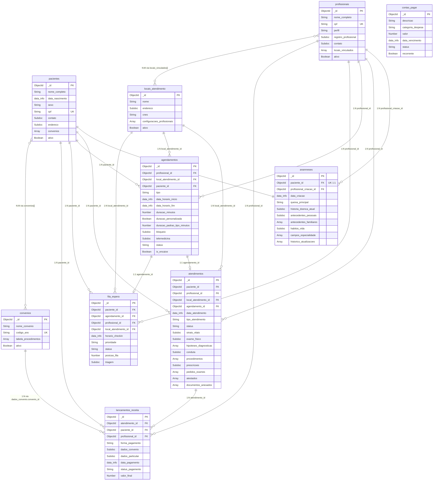

# Modelo de Dados MongoDB — Sistema de Consultório Médico

> **Versão final consolidada** — inclui todas as etapas e ajustes.

---

## Sumário

1. [Sub-documentos Reutilizáveis](#sub-documentos-reutilizáveis)
2. [Collection: `pacientes`](#collection-pacientes)
3. [Collection: `anamneses`](#collection-anamneses)
4. [Collection: `atendimentos`](#collection-atendimentos)
5. [Collection: `profissionais`](#collection-profissionais)
6. [Collection: `locais_atendimento`](#collection-locais_atendimento)
7. [Collection: `agendamentos`](#collection-agendamentos)
8. [Collection: `fila_espera`](#collection-fila_espera)
9. [Collection: `convenios`](#collection-convenios)
10. [Collection: `lancamentos_receita`](#collection-lancamentos_receita)
11. [Collection: `contas_pagar`](#collection-contas_pagar)
12. [Nota sobre o Módulo Gerencial / Dashboard](#nota-sobre-o-módulo-gerencial--dashboard)
13. [Diagrama de Relacionamento (Mermaid)](#diagrama-de-relacionamento)

---

## Sub-documentos Reutilizáveis

### `data_info`

Todo campo de data relevante utiliza este sub-documento. O desmembramento evita operações `$dateFromParts` / `$month` em queries de agregação de dashboards. Os campos numéricos permitem compound indexes diretos para filtros por período.

```json
{
  "data_completa": { "type": "Date", "required": true, "description": "ISODate completo (UTC)" },
  "dia":           { "type": "Number", "required": true, "description": "Dia do mês (1-31)" },
  "mes":           { "type": "Number", "required": true, "description": "Mês (1-12)" },
  "ano":           { "type": "Number", "required": true, "description": "Ano (ex: 2026)" },
  "dia_semana":    { "type": "Number", "required": true, "description": "0=domingo, 6=sábado" },
  "semana_ano":    { "type": "Number", "required": true, "description": "Semana do ano (1-53)" },
  "trimestre":     { "type": "Number", "required": true, "description": "Trimestre (1-4)" }
}
```

### `endereco`

```json
{
  "logradouro":  { "type": "String", "required": true },
  "numero":      { "type": "String", "required": true },
  "complemento": { "type": "String", "required": false },
  "bairro":      { "type": "String", "required": true },
  "cidade":      { "type": "String", "required": true },
  "estado":      { "type": "String", "required": true, "description": "UF com 2 caracteres" },
  "cep":         { "type": "String", "required": true, "description": "Formato 00000-000" },
  "pais":        { "type": "String", "required": false, "default": "Brasil" }
}
```

### `contato`

```json
{
  "telefone_principal":   { "type": "String", "required": true, "description": "Com DDD" },
  "telefone_secundario":  { "type": "String", "required": false },
  "email":                { "type": "String", "required": false },
  "contato_emergencia": {
    "type": "Subdocument",
    "required": false,
    "fields": {
      "nome":       { "type": "String", "required": true },
      "parentesco": { "type": "String", "required": false },
      "telefone":   { "type": "String", "required": true }
    }
  }
}
```

---

## Collection: `pacientes`

**Descrição e propósito:** Armazena o cadastro demográfico e administrativo de cada paciente. Documento-raiz ao qual todas as informações clínicas se vinculam por referência. Não contém dados clínicos.

### Estrutura do documento

```json
{
  "_id":            { "type": "ObjectId", "required": true },
  "nome_completo":  { "type": "String", "required": true },
  "data_nascimento": { "type": "Subdocument (data_info)", "required": true },
  "sexo":           { "type": "String", "required": true, "enum": ["masculino", "feminino", "intersexo"] },
  "cpf":            { "type": "String", "required": true, "description": "Somente dígitos, 11 caracteres. Unique." },
  "rg":             { "type": "String", "required": false },
  "nome_mae":       { "type": "String", "required": false },
  "naturalidade":   { "type": "String", "required": false },
  "contato":        { "type": "Subdocument (contato)", "required": true },
  "endereco":       { "type": "Subdocument (endereco)", "required": true },
  "convenios": {
    "type": "Array of Subdocument",
    "required": false,
    "items": {
      "convenio_id":        { "type": "ObjectId", "ref": "convenios", "required": true },
      "numero_carteirinha": { "type": "String", "required": true },
      "validade":           { "type": "Subdocument (data_info)", "required": false },
      "plano":              { "type": "String", "required": false }
    }
  },
  "ativo": { "type": "Boolean", "required": true, "default": true }
}
```

### Embed vs. Reference

| Elemento | Decisão | Justificativa |
|---|---|---|
| `contato`, `endereco` | **Embed** | Sempre acessados junto ao paciente; não crescem; não são consultados isoladamente. |
| `convenios` (array) | **Embed com referência** | Paciente tem poucos convênios (1-3). `convenio_id` referencia `convenios` para dados completos. |
| Anamnese | **Reference** | Documento grande com lógica de versionamento. Separar evita crescimento além de 16 MB. |
| Atendimentos | **Reference** | Crescem indefinidamente; cada atendimento é um evento independente. |

### Índices

| Índice | Tipo | Campos | Justificativa |
|---|---|---|---|
| CPF único | Single, unique | `{ cpf: 1 }` | Busca direta; garante unicidade. |
| Nome (texto) | Text | `{ nome_completo: "text" }` | Busca por nome parcial na recepção. |
| Convênio + carteirinha | Compound | `{ "convenios.convenio_id": 1, "convenios.numero_carteirinha": 1 }` | Localizar paciente por dados do convênio. |
| Ativo | Single | `{ ativo: 1 }` | Filtrar pacientes ativos em listagens. |

### Relacionamentos

- `convenios[].convenio_id` → `convenios._id`
- Referenciado por: `anamneses`, `atendimentos`, `agendamentos`, `fila_espera`, `lancamentos_receita`

---

## Collection: `anamneses`

**Descrição e propósito:** Documento **único por paciente**, criado na primeira consulta. Concentra o histórico clínico de base. Atualizável com preservação de histórico (snapshot do valor anterior, data, profissional).

### Estrutura do documento

```json
{
  "_id":                    { "type": "ObjectId", "required": true },
  "paciente_id":            { "type": "ObjectId", "ref": "pacientes", "required": true, "description": "1:1 com paciente" },
  "profissional_criacao_id": { "type": "ObjectId", "ref": "profissionais", "required": true },
  "data_criacao":           { "type": "Subdocument (data_info)", "required": true },

  "queixa_principal": { "type": "String", "required": false, "description": "Texto livre — queixa nas palavras do paciente" },

  "historia_doenca_atual": {
    "type": "Subdocument", "required": false,
    "fields": {
      "descricao":            { "type": "String", "description": "Texto livre — narrativa cronológica" },
      "data_inicio_sintomas": { "type": "Subdocument (data_info)", "required": false },
      "localizacao":          { "type": "String", "required": false },
      "intensidade":          { "type": "Number", "required": false, "description": "Escala 0-10" },
      "fatores_melhora":      { "type": "String", "required": false },
      "fatores_piora":        { "type": "String", "required": false }
    }
  },

  "antecedentes_pessoais": {
    "type": "Subdocument", "required": false,
    "fields": {
      "doencas_previas": {
        "type": "Array of Subdocument",
        "items": {
          "doenca":           { "type": "String", "required": true },
          "cid_codigo":       { "type": "String", "required": false },
          "cid_descricao":    { "type": "String", "required": false },
          "data_diagnostico": { "type": "Subdocument (data_info)", "required": false },
          "status":           { "type": "String", "enum": ["ativo", "resolvido"], "required": true },
          "observacoes":      { "type": "String", "required": false }
        }
      },
      "cirurgias": {
        "type": "Array of Subdocument",
        "items": {
          "procedimento": { "type": "String", "required": true },
          "data":         { "type": "Subdocument (data_info)", "required": false },
          "hospital":     { "type": "String", "required": false },
          "observacoes":  { "type": "String", "required": false }
        }
      },
      "alergias": {
        "type": "Array of Subdocument",
        "items": {
          "tipo":       { "type": "String", "enum": ["medicamento", "alimento", "outro"], "required": true },
          "substancia": { "type": "String", "required": true },
          "gravidade":  { "type": "String", "enum": ["leve", "moderada", "grave"], "required": true },
          "reacao":     { "type": "String", "required": false }
        }
      },
      "medicamentos_uso_continuo": {
        "type": "Array of Subdocument",
        "items": {
          "nome_medicamento": { "type": "String", "required": true },
          "principio_ativo":  { "type": "String", "required": false },
          "dosagem":          { "type": "String", "required": true },
          "via_administracao": { "type": "String", "required": false },
          "frequencia":       { "type": "String", "required": true },
          "data_inicio":      { "type": "Subdocument (data_info)", "required": false }
        }
      },
      "internacoes": {
        "type": "Array of Subdocument",
        "items": {
          "motivo":       { "type": "String", "required": true },
          "data":         { "type": "Subdocument (data_info)", "required": false },
          "local":        { "type": "String", "required": false },
          "duracao_dias": { "type": "Number", "required": false }
        }
      }
    }
  },

  "antecedentes_familiares": {
    "type": "Array of Subdocument", "required": false,
    "items": {
      "grau_parentesco": { "type": "String", "required": true },
      "doenca":          { "type": "String", "required": true },
      "cid_codigo":      { "type": "String", "required": false },
      "cid_descricao":   { "type": "String", "required": false },
      "observacoes":     { "type": "String", "required": false }
    }
  },

  "habitos_vida": {
    "type": "Subdocument", "required": false,
    "fields": {
      "tabagismo": {
        "type": "Subdocument",
        "fields": {
          "status":            { "type": "String", "enum": ["nunca", "ex", "atual"], "required": true },
          "quantidade_por_dia": { "type": "Number", "required": false },
          "tempo_anos":        { "type": "Number", "required": false },
          "observacoes":       { "type": "String", "required": false }
        }
      },
      "etilismo": {
        "type": "Subdocument",
        "fields": {
          "status":     { "type": "String", "enum": ["nunca", "social", "regular", "ex"], "required": true },
          "frequencia": { "type": "String", "required": false },
          "tipo":       { "type": "String", "required": false },
          "observacoes": { "type": "String", "required": false }
        }
      },
      "atividade_fisica": {
        "type": "Subdocument",
        "fields": {
          "pratica":            { "type": "Boolean", "required": true },
          "tipo":               { "type": "String", "required": false },
          "frequencia_semanal": { "type": "Number", "required": false },
          "observacoes":        { "type": "String", "required": false }
        }
      },
      "alimentacao": { "type": "String", "required": false },
      "sono": {
        "type": "Subdocument",
        "fields": {
          "qualidade":       { "type": "String", "enum": ["boa", "regular", "ruim"], "required": false },
          "horas_por_noite": { "type": "Number", "required": false },
          "observacoes":     { "type": "String", "required": false }
        }
      },
      "outros": { "type": "String", "required": false }
    }
  },

  "campos_especialidade": {
    "type": "Array of Subdocument", "required": false,
    "items": {
      "especialidade":  { "type": "String", "required": true },
      "campos_extras":  { "type": "Object", "required": true, "description": "Schema flexível por especialidade" }
    }
  },

  "historico_atualizacoes": {
    "type": "Array of Subdocument", "required": false,
    "description": "Log de toda alteração — requisito legal/clínico",
    "items": {
      "data_alteracao":  { "type": "Subdocument (data_info)", "required": true },
      "profissional_id": { "type": "ObjectId", "ref": "profissionais", "required": true },
      "campo_alterado":  { "type": "String", "required": true, "description": "Path do campo" },
      "valor_anterior":  { "type": "Mixed", "required": true },
      "valor_novo":      { "type": "Mixed", "required": true },
      "motivo":          { "type": "String", "required": false }
    }
  }
}
```

### Embed vs. Reference

| Elemento | Decisão | Justificativa |
|---|---|---|
| Sub-documentos clínicos | **Embed** | Sempre lidos junto à anamnese. Padrão de acesso: "abrir anamnese completa do paciente". |
| `historico_atualizacoes` | **Embed** | Crescimento controlado (dezenas ao longo de anos). Lido junto para auditoria. |
| `campos_especialidade` | **Embed** | Array pequeno (1 item por especialidade). Schema flexível via `Object`. |
| `paciente_id` | **Reference** | Documento separado para isolar crescimento. Relação 1:1 por unique index. |

### Índices

| Índice | Tipo | Campos | Justificativa |
|---|---|---|---|
| Paciente (único) | Single, unique | `{ paciente_id: 1 }` | Garante 1:1; busca direta. |
| CID doenças prévias | Single | `{ "antecedentes_pessoais.doencas_previas.cid_codigo": 1 }` | Relatórios epidemiológicos. |
| CID familiares | Single | `{ "antecedentes_familiares.cid_codigo": 1 }` | Relatórios por histórico familiar. |
| Alergias | Single | `{ "antecedentes_pessoais.alergias.substancia": 1 }` | Verificação de interações medicamentosas. |
| Text index clínico | Text | `{ "queixa_principal": "text", "historia_doenca_atual.descricao": "text" }` | Busca textual em dados narrativos. |

### Relacionamentos

- `paciente_id` → `pacientes._id` (1:1)
- `profissional_criacao_id` → `profissionais._id`
- `historico_atualizacoes[].profissional_id` → `profissionais._id`

---

## Collection: `atendimentos`

**Descrição e propósito:** Cada consulta gera um documento independente — o registro da evolução clínica. Imutável após finalização. Collection com maior volume de crescimento.

### Estrutura do documento

```json
{
  "_id": { "type": "ObjectId", "required": true },

  "paciente_id":          { "type": "ObjectId", "ref": "pacientes", "required": true },
  "profissional_id":      { "type": "ObjectId", "ref": "profissionais", "required": true },
  "local_atendimento_id": { "type": "ObjectId", "ref": "locais_atendimento", "required": true },
  "agendamento_id":       { "type": "ObjectId", "ref": "agendamentos", "required": false },
  "data_atendimento":     { "type": "Subdocument (data_info)", "required": true },

  "tipo_atendimento": {
    "type": "String", "required": true,
    "enum": ["primeira_consulta", "consulta", "retorno", "encaixe", "telemedicina"]
  },
  "status": {
    "type": "String", "required": true,
    "enum": ["em_andamento", "finalizado", "cancelado"]
  },

  "nome_paciente":     { "type": "String", "required": true, "description": "Desnormalizado" },
  "nome_profissional": { "type": "String", "required": true, "description": "Desnormalizado" },

  "sinais_vitais": {
    "type": "Subdocument", "required": false,
    "fields": {
      "pressao_arterial_sistolica":  { "type": "Number", "required": false, "description": "mmHg" },
      "pressao_arterial_diastolica": { "type": "Number", "required": false, "description": "mmHg" },
      "frequencia_cardiaca":         { "type": "Number", "required": false, "description": "bpm" },
      "frequencia_respiratoria":     { "type": "Number", "required": false, "description": "irpm" },
      "temperatura":                 { "type": "Number", "required": false, "description": "°C" },
      "saturacao_o2":                { "type": "Number", "required": false, "description": "%" },
      "peso":                        { "type": "Number", "required": false, "description": "kg" },
      "altura":                      { "type": "Number", "required": false, "description": "cm" },
      "imc":                         { "type": "Number", "required": false, "description": "Calculado" },
      "glicemia_capilar":            { "type": "Number", "required": false, "description": "mg/dL" },
      "observacoes_vitais":          { "type": "String", "required": false }
    }
  },

  "exame_fisico": {
    "type": "Subdocument", "required": false,
    "fields": {
      "estado_geral": { "type": "String", "required": false },
      "segmentar": {
        "type": "Subdocument",
        "fields": {
          "cabeca_pescoco": { "type": "Subdocument", "fields": { "normal": "Boolean", "descricao": "String" } },
          "torax_pulmoes":  { "type": "Subdocument", "fields": { "normal": "Boolean", "descricao": "String" } },
          "cardiovascular": { "type": "Subdocument", "fields": { "normal": "Boolean", "descricao": "String" } },
          "abdomen":        { "type": "Subdocument", "fields": { "normal": "Boolean", "descricao": "String" } },
          "extremidades":   { "type": "Subdocument", "fields": { "normal": "Boolean", "descricao": "String" } },
          "neurologico":    { "type": "Subdocument", "fields": { "normal": "Boolean", "descricao": "String" } },
          "pele":           { "type": "Subdocument", "fields": { "normal": "Boolean", "descricao": "String" } }
        }
      },
      "exame_fisico_complementar": { "type": "String", "required": false }
    }
  },

  "hipoteses_diagnosticas": {
    "type": "Array of Subdocument", "required": false,
    "items": {
      "descricao":     { "type": "String", "required": true },
      "cid_codigo":    { "type": "String", "required": false },
      "cid_descricao": { "type": "String", "required": false },
      "tipo":          { "type": "String", "enum": ["principal", "secundaria"], "required": true },
      "status":        { "type": "String", "enum": ["hipotese", "confirmado"], "required": true }
    }
  },

  "conduta": {
    "type": "Subdocument", "required": false,
    "fields": {
      "plano_terapeutico":    { "type": "String", "required": false },
      "orientacoes_paciente": { "type": "String", "required": false }
    }
  },

  "procedimentos": {
    "type": "Array of Subdocument", "required": false,
    "items": {
      "descricao_procedimento": { "type": "String", "required": true },
      "codigo_procedimento":    { "type": "String", "required": false },
      "data":                   { "type": "Subdocument (data_info)", "required": false },
      "observacoes":            { "type": "String", "required": false }
    }
  },

  "prescricoes": {
    "type": "Subdocument", "required": false,
    "fields": {
      "tipo_receita":   { "type": "String", "enum": ["simples", "especial", "controle_especial"], "required": true },
      "numero_receita": { "type": "String", "required": true },
      "itens": {
        "type": "Array of Subdocument",
        "items": {
          "nome_medicamento":  { "type": "String", "required": true },
          "principio_ativo":   { "type": "String", "required": false },
          "dosagem":           { "type": "String", "required": true },
          "via_administracao": { "type": "String", "enum": ["oral","intravenosa","intramuscular","topica","subcutanea","inalatoria","outra"], "required": true },
          "frequencia":        { "type": "String", "required": true },
          "duracao":           { "type": "String", "required": true },
          "quantidade":        { "type": "Number", "required": false },
          "observacoes":       { "type": "String", "required": false }
        }
      }
    }
  },

  "pedidos_exames": {
    "type": "Array of Subdocument", "required": false,
    "items": {
      "tipo_exame":            { "type": "String", "enum": ["laboratorial", "imagem", "outro"], "required": true },
      "descricao_exame":       { "type": "String", "required": true },
      "codigo_exame":          { "type": "String", "required": false },
      "justificativa_clinica": { "type": "String", "required": false },
      "urgencia":              { "type": "String", "enum": ["rotina", "urgente"], "required": true },
      "status":                { "type": "String", "enum": ["solicitado", "realizado", "resultado_disponivel"], "required": true },
      "data_solicitacao":      { "type": "Subdocument (data_info)", "required": true },
      "data_resultado":        { "type": "Subdocument (data_info)", "required": false },
      "resultado_resumo":      { "type": "String", "required": false },
      "arquivo_resultado_ref": { "type": "String", "required": false }
    }
  },

  "atestados": {
    "type": "Array of Subdocument", "required": false,
    "items": {
      "tipo":              { "type": "String", "enum": ["atestado_medico", "declaracao_comparecimento", "laudo", "outro"], "required": true },
      "descricao":         { "type": "String", "required": true },
      "cid_codigo":        { "type": "String", "required": false },
      "dias_afastamento":  { "type": "Number", "required": false },
      "data_emissao":      { "type": "Subdocument (data_info)", "required": true }
    }
  },

  "documentos_anexados": {
    "type": "Array of Subdocument", "required": false,
    "items": {
      "tipo_documento":         { "type": "String", "enum": ["raio_x","tomografia","ressonancia","laudo","exame_laboratorial","foto_clinica","outro"], "required": true },
      "descricao":              { "type": "String", "required": false },
      "nome_arquivo":           { "type": "String", "required": true },
      "caminho_armazenamento":  { "type": "String", "required": true },
      "mime_type":              { "type": "String", "required": true },
      "tamanho_bytes":          { "type": "Number", "required": true },
      "data_upload":            { "type": "Subdocument (data_info)", "required": true },
      "profissional_upload_id": { "type": "ObjectId", "ref": "profissionais", "required": true }
    }
  }
}
```

### Embed vs. Reference

| Elemento | Decisão | Justificativa |
|---|---|---|
| `sinais_vitais`, `exame_fisico`, `conduta` | **Embed** | Sempre lidos junto ao atendimento. Estrutura fixa, sem crescimento. |
| `hipoteses_diagnosticas` | **Embed** | 1-5 por consulta. Indexação em `cid_codigo` no array para relatórios. |
| `procedimentos` | **Embed** | 0-3 por consulta. Sempre lidos junto ao atendimento. |
| `prescricoes` | **Embed** | Uma receita com 1-10 itens. Lida junto à consulta para impressão. |
| `pedidos_exames` | **Embed** | 1-5 por consulta. Status atualizado in-place via `$set` posicional. |
| `atestados` | **Embed** | 1-2 por consulta. Sempre lidos junto ao atendimento. |
| `documentos_anexados` | **Embed (metadados)** | Binários ficam em storage externo. Array de metadados cresce moderadamente. |
| Referências (`paciente_id`, etc.) | **Reference** | Entidades independentes com ciclo de vida próprio. |

### Índices

| Índice | Tipo | Campos | Justificativa |
|---|---|---|---|
| Paciente + data | Compound | `{ paciente_id: 1, "data_atendimento.ano": -1, "data_atendimento.mes": -1 }` | Histórico do prontuário (cronologia reversa). |
| Profissional + período | Compound | `{ profissional_id: 1, "data_atendimento.ano": -1, "data_atendimento.mes": -1 }` | Relatórios por médico por período. |
| Profissional + local + data | Compound | `{ profissional_id: 1, local_atendimento_id: 1, "data_atendimento.data_completa": -1 }` | Dashboard por local. |
| CID (código) | Single | `{ "hipoteses_diagnosticas.cid_codigo": 1 }` | Ranking de CIDs mais frequentes. |
| CID (texto) | Text | `{ "hipoteses_diagnosticas.cid_descricao": "text", "hipoteses_diagnosticas.descricao": "text" }` | Busca textual por diagnóstico. |
| Status | Single | `{ status: 1 }` | Filtrar em andamento. |
| Tipo + período | Compound | `{ tipo_atendimento: 1, "data_atendimento.ano": 1, "data_atendimento.trimestre": 1 }` | Distribuição por tipo. |
| Agendamento | Single | `{ agendamento_id: 1 }` | Lookup reverso. |
| Procedimento | Single | `{ "procedimentos.codigo_procedimento": 1 }` | Ranking de procedimentos. |
| Sinais vitais (range) | Compound | `{ "sinais_vitais.pressao_arterial_sistolica": 1, "sinais_vitais.pressao_arterial_diastolica": 1 }` | Range queries clínicos. |

### Relacionamentos

- `paciente_id` → `pacientes._id` (N:1)
- `profissional_id` → `profissionais._id` (N:1)
- `local_atendimento_id` → `locais_atendimento._id` (N:1)
- `agendamento_id` → `agendamentos._id` (1:1)
- `documentos_anexados[].profissional_upload_id` → `profissionais._id` (N:1)

### Nota sobre crescimento

~90.000 docs/ano (30 pac/dia). Cada doc ~2-8 KB. Campos desnormalizados evitam `$lookup` nas listagens. Compound index `paciente_id + data` cobre a query mais crítica. Sharding por `paciente_id` viável no futuro.

---

## Collection: `profissionais`

**Descrição e propósito:** Cadastro dos usuários do sistema (médicos e atendentes).

### Estrutura do documento

```json
{
  "_id":            { "type": "ObjectId", "required": true },
  "nome_completo":  { "type": "String", "required": true },
  "cpf":            { "type": "String", "required": true },
  "perfil":         { "type": "String", "enum": ["medico", "atendente"], "required": true },
  "registro_profissional": {
    "type": "Subdocument", "required": false,
    "description": "Obrigatório quando perfil=medico",
    "fields": {
      "crm":             { "type": "String", "required": true },
      "uf_crm":          { "type": "String", "required": true },
      "especialidades":  { "type": "Array of String", "required": false }
    }
  },
  "contato":            { "type": "Subdocument (contato)", "required": true },
  "locais_vinculados":  { "type": "Array of ObjectId", "ref": "locais_atendimento", "required": false },
  "ativo":              { "type": "Boolean", "required": true, "default": true }
}
```

### Índices

| Índice | Tipo | Campos | Justificativa |
|---|---|---|---|
| CPF único | Single, unique | `{ cpf: 1 }` | Login e busca. |
| CRM + UF | Compound, unique | `{ "registro_profissional.crm": 1, "registro_profissional.uf_crm": 1 }` | Unicidade do registro médico. |
| Perfil + ativo | Compound | `{ perfil: 1, ativo: 1 }` | Listar médicos/atendentes ativos. |
| Nome (texto) | Text | `{ nome_completo: "text" }` | Busca por nome. |

---

## Collection: `locais_atendimento`

**Descrição e propósito:** Cadastro de consultórios/clínicas. Contém a configuração de agenda **por profissional**, incluindo durações padrão por tipo de atendimento.

### Estrutura do documento

```json
{
  "_id":      { "type": "ObjectId", "required": true },
  "nome":     { "type": "String", "required": true },
  "endereco": { "type": "Subdocument (endereco)", "required": true },
  "telefone": { "type": "String", "required": false },
  "cnes":     { "type": "String", "required": false },
  "ativo":    { "type": "Boolean", "required": true, "default": true },

  "configuracoes_profissionais": {
    "type": "Array of Subdocument",
    "required": false,
    "description": "Uma entrada por profissional que atende neste local",
    "items": {
      "profissional_id": { "type": "ObjectId", "ref": "profissionais", "required": true },

      "horarios_funcionamento": {
        "type": "Array of Subdocument",
        "items": {
          "dia_semana":       { "type": "Number", "required": true, "description": "0=dom, 6=sáb" },
          "hora_inicio":      { "type": "String", "required": true, "description": "HH:mm" },
          "hora_fim":         { "type": "String", "required": true, "description": "HH:mm" },
          "intervalo_inicio": { "type": "String", "required": false },
          "intervalo_fim":    { "type": "String", "required": false }
        }
      },

      "duracoes_por_tipo": {
        "type": "Subdocument",
        "required": true,
        "description": "Duração padrão em minutos para cada tipo. Valores DEVEM ser múltiplos de 5. Mín: 5, Máx: 120.",
        "fields": {
          "primeira_consulta": { "type": "Number", "required": true, "default": 30 },
          "consulta":          { "type": "Number", "required": true, "default": 20 },
          "retorno":           { "type": "Number", "required": true, "default": 15 },
          "encaixe":           { "type": "Number", "required": true, "default": 15 },
          "telemedicina":      { "type": "Number", "required": true, "default": 20 }
        }
      }
    }
  }
}
```

### Regras de validação (application-level)

| Regra | Descrição |
|---|---|
| Múltiplo de 5 | Todo valor em `duracoes_por_tipo` deve satisfazer `valor % 5 === 0`. |
| Limites | Mínimo 5 minutos, máximo 120 minutos. |
| Unicidade | Não pode haver dois itens em `configuracoes_profissionais` com o mesmo `profissional_id`. |

### Índices

| Índice | Tipo | Campos | Justificativa |
|---|---|---|---|
| Nome (texto) | Text | `{ nome: "text" }` | Busca por nome. |
| Ativo | Single | `{ ativo: 1 }` | Filtrar ativos. |
| Profissional no local | Single | `{ "configuracoes_profissionais.profissional_id": 1 }` | Buscar locais de um profissional. |

---

## Collection: `agendamentos`

**Descrição e propósito:** Representa **tudo que ocupa um slot na agenda** — consultas de qualquer tipo e bloqueios. A unificação permite montar a grade de disponibilidade com uma única query.

### Estrutura do documento

```json
{
  "_id":             { "type": "ObjectId", "required": true },
  "profissional_id": { "type": "ObjectId", "ref": "profissionais", "required": true },
  "local_atendimento_id": { "type": "ObjectId", "ref": "locais_atendimento", "required": true },

  "tipo": {
    "type": "String", "required": true,
    "enum": ["primeira_consulta", "consulta", "retorno", "encaixe", "telemedicina", "bloqueio"],
    "description": "Define a natureza do slot. 'consulta' é o padrão."
  },

  "paciente_id": {
    "type": "ObjectId", "ref": "pacientes", "required": false,
    "description": "Obrigatório para todos os tipos EXCETO bloqueio."
  },

  "data_horario_inicio": { "type": "Subdocument (data_info)", "required": true },
  "data_horario_fim":    { "type": "Subdocument (data_info)", "required": false, "description": "Para consultas: calculado. Para bloqueios: definido explicitamente." },

  "duracao_minutos": {
    "type": "Number", "required": true,
    "description": "Duração efetiva. Múltiplo de 5. Valor padrão vem de locais_atendimento.configuracoes_profissionais[].duracoes_por_tipo[tipo]."
  },
  "duracao_personalizada": {
    "type": "Boolean", "required": true, "default": false,
    "description": "true = médico ou atendente definiu duração diferente do padrão."
  },
  "duracao_padrao_tipo_minutos": {
    "type": "Number", "required": true,
    "description": "Snapshot da duração padrão do tipo no momento do agendamento. Permite comparar com o valor efetivo."
  },

  "bloqueio": {
    "type": "Subdocument", "required": false,
    "description": "Preenchido apenas quando tipo=bloqueio",
    "fields": {
      "motivo":    { "type": "String", "required": false },
      "categoria": { "type": "String", "enum": ["ferias", "intervalo", "indisponibilidade", "outro"], "required": true },
      "recorrente": { "type": "Boolean", "required": true, "default": false },
      "recorrencia": {
        "type": "Subdocument", "required": false,
        "fields": {
          "dias_semana": { "type": "Array of Number" },
          "hora_inicio": { "type": "String" },
          "hora_fim":    { "type": "String" }
        }
      }
    }
  },

  "telemedicina": {
    "type": "Subdocument", "required": false,
    "description": "Preenchido apenas quando tipo=telemedicina",
    "fields": {
      "link_sala_virtual": { "type": "String", "required": true },
      "plataforma":        { "type": "String", "required": false }
    }
  },

  "status": {
    "type": "String", "required": true,
    "enum": ["agendado", "confirmado", "em_espera", "em_atendimento", "finalizado", "cancelado", "faltou", "bloqueado"],
    "description": "Para bloqueios: 'bloqueado' (ativo) ou 'cancelado'. Para consultas: fluxo normal."
  },

  "is_encaixe": { "type": "Boolean", "required": true, "default": false },
  "observacoes": { "type": "String", "required": false },

  "nome_paciente":     { "type": "String", "required": false, "description": "Null quando tipo=bloqueio" },
  "nome_profissional": { "type": "String", "required": true },
  "telefone_paciente": { "type": "String", "required": false },
  "convenio_nome":     { "type": "String", "required": false }
}
```

### Regras de validação por tipo

| Campo | Consultas (primeira_consulta / consulta / retorno / encaixe / telemedicina) | Bloqueio |
|---|---|---|
| `paciente_id` | Obrigatório | Null |
| `nome_paciente` | Obrigatório | Null |
| `bloqueio` (sub-doc) | Null | Obrigatório |
| `telemedicina` (sub-doc) | Somente se tipo=telemedicina | Null |
| `status` | agendado → confirmado → em_espera → em_atendimento → finalizado / cancelado / faltou | bloqueado / cancelado |
| `data_horario_fim` | Calculado (inicio + duração) | Definido explicitamente |

### Lógica de preenchimento de duração

```javascript
// Ao criar agendamento:
const config = local.configuracoes_profissionais
  .find(c => c.profissional_id === profissional_id);
const duracaoPadrao = config.duracoes_por_tipo[tipo];

// Sem personalização:
agendamento.duracao_minutos = duracaoPadrao;
agendamento.duracao_personalizada = false;
agendamento.duracao_padrao_tipo_minutos = duracaoPadrao;

// Com personalização (validar: valor % 5 === 0, >= 5, <= 120):
agendamento.duracao_minutos = valorInformado;
agendamento.duracao_personalizada = true;
agendamento.duracao_padrao_tipo_minutos = duracaoPadrao;

// Calcular fim:
agendamento.data_horario_fim = inicio + duracao_minutos;
```

### Índices

| Índice | Tipo | Campos | Justificativa |
|---|---|---|---|
| Grade do dia | Compound | `{ profissional_id: 1, local_atendimento_id: 1, "data_horario_inicio.data_completa": 1 }` | Query principal: consultas + bloqueios em uma única chamada. |
| Visão mensal | Compound | `{ profissional_id: 1, "data_horario_inicio.ano": 1, "data_horario_inicio.mes": 1 }` | Calendário e ocupação. |
| Tipo + período | Compound | `{ tipo: 1, "data_horario_inicio.ano": 1, "data_horario_inicio.mes": 1 }` | Filtrar por tipo; relatórios de distribuição. |
| Paciente | Single (sparse) | `{ paciente_id: 1 }` | Histórico do paciente. Sparse ignora bloqueios. |
| Status + data | Compound | `{ status: 1, "data_horario_inicio.ano": 1, "data_horario_inicio.mes": 1 }` | Taxas de cancelamento/faltas. |
| Encaixes | Compound | `{ is_encaixe: 1, profissional_id: 1, "data_horario_inicio.data_completa": 1 }` | Encaixes do dia. |
| Bloqueios (overlap) | Compound | `{ profissional_id: 1, tipo: 1, "data_horario_inicio.data_completa": 1, "data_horario_fim.data_completa": 1 }` | Verificar se horário cai em bloqueio. |

### Relacionamentos

- `profissional_id` → `profissionais._id`
- `local_atendimento_id` → `locais_atendimento._id`
- `paciente_id` → `pacientes._id`
- Referenciado por: `atendimentos.agendamento_id`, `fila_espera.agendamento_id`

---

## Collection: `fila_espera`

**Descrição e propósito:** Fluxo operacional do dia — check-in até encaminhamento ao consultório. Documento de vida curta (TTL 48h).

### Estrutura do documento

```json
{
  "_id":            { "type": "ObjectId", "required": true },
  "paciente_id":    { "type": "ObjectId", "ref": "pacientes", "required": true },
  "agendamento_id": { "type": "ObjectId", "ref": "agendamentos", "required": false },
  "profissional_id": { "type": "ObjectId", "ref": "profissionais", "required": true },
  "local_atendimento_id": { "type": "ObjectId", "ref": "locais_atendimento", "required": true },

  "horario_checkin":             { "type": "Subdocument (data_info)", "required": true },
  "horario_inicio_atendimento":  { "type": "Subdocument (data_info)", "required": false },
  "horario_fim_atendimento":     { "type": "Subdocument (data_info)", "required": false },

  "prioridade": { "type": "String", "enum": ["normal", "prioritario", "urgente"], "required": true, "default": "normal" },
  "status":     { "type": "String", "enum": ["aguardando", "em_atendimento", "atendido", "desistiu"], "required": true },
  "posicao_fila": { "type": "Number", "required": true },

  "triagem": {
    "type": "Subdocument", "required": false,
    "fields": {
      "queixa_rapida":               { "type": "String", "required": false },
      "pressao_arterial_sistolica":  { "type": "Number", "required": false },
      "pressao_arterial_diastolica": { "type": "Number", "required": false },
      "temperatura":                 { "type": "Number", "required": false },
      "peso":                        { "type": "Number", "required": false },
      "altura":                      { "type": "Number", "required": false }
    }
  },

  "nome_paciente":     { "type": "String", "required": true },
  "nome_profissional": { "type": "String", "required": true }
}
```

### Índices

| Índice | Tipo | Campos | Justificativa |
|---|---|---|---|
| Fila ativa | Compound | `{ profissional_id: 1, local_atendimento_id: 1, status: 1, posicao_fila: 1 }` | Listar pacientes aguardando, ordenados. |
| Tempo de espera | Compound | `{ "horario_checkin.data_completa": 1, status: 1 }` | Dashboard de tempo médio. |
| TTL | TTL | `{ "horario_checkin.data_completa": 1 }`, expireAfterSeconds: 172800 | Auto-expiração em 48h. |

---

## Collection: `convenios`

**Descrição e propósito:** Cadastro de convênios/planos de saúde aceitos. Inclui tabela de procedimentos com valores.

### Estrutura do documento

```json
{
  "_id":           { "type": "ObjectId", "required": true },
  "nome_convenio": { "type": "String", "required": true },
  "codigo_ans":    { "type": "String", "required": false },
  "contato": {
    "type": "Subdocument", "required": false,
    "fields": {
      "telefone":      { "type": "String" },
      "email":         { "type": "String" },
      "representante": { "type": "String" }
    }
  },
  "tabela_procedimentos": {
    "type": "Array of Subdocument", "required": false,
    "items": {
      "codigo":    { "type": "String", "required": true },
      "descricao": { "type": "String", "required": true },
      "valor":     { "type": "Number", "required": true }
    }
  },
  "ativo": { "type": "Boolean", "required": true, "default": true }
}
```

### Índices

| Índice | Tipo | Campos | Justificativa |
|---|---|---|---|
| Nome (texto) | Text | `{ nome_convenio: "text" }` | Busca por nome. |
| Código ANS | Single, unique (sparse) | `{ codigo_ans: 1 }` | Busca por registro. |
| Procedimento | Single | `{ "tabela_procedimentos.codigo": 1 }` | Busca de valor por código. |

---

## Collection: `lancamentos_receita`

**Descrição e propósito:** Recebimentos vinculados a atendimentos. Base para relatórios de receita e fluxo de caixa.

### Estrutura do documento

```json
{
  "_id":              { "type": "ObjectId", "required": true },
  "atendimento_id":   { "type": "ObjectId", "ref": "atendimentos", "required": true },
  "paciente_id":      { "type": "ObjectId", "ref": "pacientes", "required": true },
  "profissional_id":  { "type": "ObjectId", "ref": "profissionais", "required": true },

  "forma_pagamento": { "type": "String", "enum": ["dinheiro","cartao_credito","cartao_debito","pix","convenio"], "required": true },

  "dados_convenio": {
    "type": "Subdocument", "required": false,
    "fields": {
      "convenio_id":        { "type": "ObjectId", "ref": "convenios", "required": true },
      "numero_guia":        { "type": "String", "required": true },
      "codigo_procedimento": { "type": "String", "required": true },
      "valor_tabela":       { "type": "Number", "required": true },
      "status_faturamento": { "type": "String", "enum": ["pendente","enviado","pago","glosado"], "required": true }
    }
  },

  "dados_particular": {
    "type": "Subdocument", "required": false,
    "fields": {
      "valor_cobrado": { "type": "Number", "required": true },
      "valor_pago":    { "type": "Number", "required": true },
      "desconto":      { "type": "Number", "required": false, "default": 0 },
      "troco":         { "type": "Number", "required": false, "default": 0 }
    }
  },

  "data_pagamento":   { "type": "Subdocument (data_info)", "required": true },
  "status_pagamento": { "type": "String", "enum": ["pendente","pago","parcial","cancelado","estornado"], "required": true },

  "tipo":       { "type": "String", "required": true, "default": "receita" },
  "categoria":  { "type": "String", "required": true, "enum": ["particular", "convenio"] },
  "valor_final": { "type": "Number", "required": true, "description": "Valor efetivo para agregações" }
}
```

### Índices

| Índice | Tipo | Campos | Justificativa |
|---|---|---|---|
| Atendimento | Single | `{ atendimento_id: 1 }` | Buscar pagamento de um atendimento. |
| Período + categoria | Compound | `{ "data_pagamento.ano": 1, "data_pagamento.mes": 1, categoria: 1 }` | Receita por período. |
| Convênio + faturamento | Compound | `{ "dados_convenio.convenio_id": 1, "dados_convenio.status_faturamento": 1 }` | Gestão de guias. |
| Status | Single | `{ status_pagamento: 1 }` | Filtrar pendentes. |
| Profissional + período | Compound | `{ profissional_id: 1, "data_pagamento.ano": 1, "data_pagamento.mes": 1 }` | Receita por médico. |
| Fluxo de caixa | Compound | `{ "data_pagamento.ano": 1, "data_pagamento.trimestre": 1, tipo: 1 }` | Agregação trimestral. |

---

## Collection: `contas_pagar`

**Descrição e propósito:** Despesas do consultório. Base para o lado "despesa" do fluxo de caixa.

### Estrutura do documento

```json
{
  "_id":               { "type": "ObjectId", "required": true },
  "descricao":         { "type": "String", "required": true },
  "fornecedor":        { "type": "String", "required": false },
  "categoria_despesa": { "type": "String", "enum": ["aluguel","material","salario","servico","imposto","outro"], "required": true },
  "valor":             { "type": "Number", "required": true },
  "data_vencimento":   { "type": "Subdocument (data_info)", "required": true },
  "data_pagamento":    { "type": "Subdocument (data_info)", "required": false },
  "status":            { "type": "String", "enum": ["pendente","pago","vencido","cancelado"], "required": true },
  "forma_pagamento":   { "type": "String", "required": false },
  "recorrente":        { "type": "Boolean", "required": true, "default": false },
  "observacoes":       { "type": "String", "required": false },
  "tipo":              { "type": "String", "required": true, "default": "despesa" },
  "categoria":         { "type": "String", "required": true }
}
```

### Índices

| Índice | Tipo | Campos | Justificativa |
|---|---|---|---|
| Status + vencimento | Compound | `{ status: 1, "data_vencimento.data_completa": 1 }` | Contas pendentes/vencidas. |
| Período | Compound | `{ "data_vencimento.ano": 1, "data_vencimento.mes": 1 }` | Despesas por período. |
| Categoria + período | Compound | `{ categoria_despesa: 1, "data_vencimento.ano": 1, "data_vencimento.mes": 1 }` | Ranking de custos. |
| Fluxo de caixa | Compound | `{ "data_vencimento.ano": 1, "data_vencimento.trimestre": 1, tipo: 1 }` | Agregação unificada com receitas. |

---

## Nota sobre o Módulo Gerencial / Dashboard

Não foi criada collection dedicada de métricas. Todas as queries de dashboard são atendidas pelas collections operacionais com os índices definidos:

| Métrica | Fonte | Índice |
|---|---|---|
| Atendimentos por período | `atendimentos` | profissional + ano + mês |
| Receita particular vs. convênio | `lancamentos_receita` | ano + mês + categoria |
| Taxa de cancelamento/faltas | `agendamentos` | status + ano + mês |
| Ocupação da agenda | `agendamentos` | profissional + local + data |
| Ranking de procedimentos | `atendimentos` | procedimentos.codigo |
| Ranking de CIDs | `atendimentos` | hipoteses.cid_codigo |
| Tempo médio de espera | `fila_espera` | horario_checkin + status |
| Fluxo de caixa | `lancamentos_receita` + `contas_pagar` | ano + trimestre + tipo |

Se o volume justificar pré-computação, adotar **materialized views pattern** com collection `metricas_diarias`.

---

## Resumo das Collections

| # | Collection | Propósito | Volume estimado |
|---|---|---|---|
| 1 | `pacientes` | Cadastro demográfico | Centenas a milhares |
| 2 | `anamneses` | Histórico clínico (1:1 paciente) | Idem pacientes |
| 3 | `atendimentos` | Evolução por consulta | ~90.000/ano |
| 4 | `profissionais` | Médicos e atendentes | Dezenas |
| 5 | `locais_atendimento` | Consultórios + config agenda | Unidades |
| 6 | `agendamentos` | Slots de agenda + bloqueios | Proporcional a atendimentos |
| 7 | `fila_espera` | Fluxo operacional (TTL 48h) | Efêmero |
| 8 | `convenios` | Planos de saúde | Dezenas |
| 9 | `lancamentos_receita` | Recebimentos financeiros | Proporcional a atendimentos |
| 10 | `contas_pagar` | Despesas do consultório | Dezenas/mês |

**Total: 10 collections** + 3 sub-documentos reutilizáveis (`data_info`, `endereco`, `contato`).

---

## Diagrama de Relacionamento


